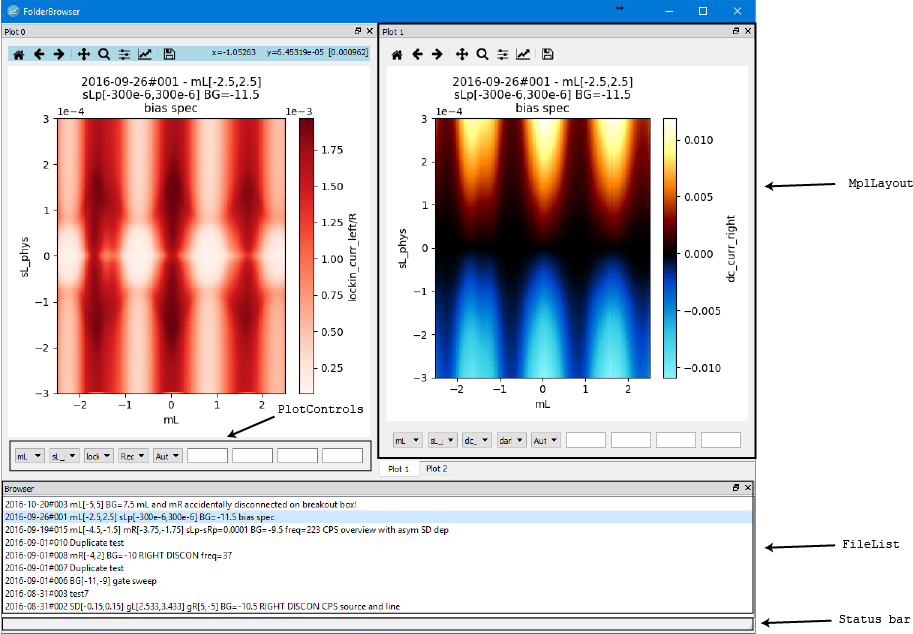

User Guide
================================================================================


Column
--------------------------------------------------------------------------------
A column is an array of raw data from a (real or virtual) instrument, e.g.,
"voltage on DMM" or "time in seconds". Depending on context "column" may mean
only a "raw" column or both "raw" and pseudocolumns.


Pseudocolumn
--------------------------------------------------------------------------------
A pseudocolumn is an array of data derived from a raw column, e.g., conductance in
units of e^2/h instead of Siemens. Pseudocolumns can be arbitrarily complex and
may involve, e.g., differentiating or integral transforming multiple columns or
other pseudocolumns. Pseudocolumns are calculated lazily in the FolderBrowser
rather than when loading the sweep. That is, the pseudocolumn is not calculated
until requested from the drop-down menus.


Pseudocolumn file
--------------------------------------------------------------------------------
A pseudocolumn file specifies a set of functions which are used for calculating
pseudocolumns. See the file [examples/pcols.py](../examples/pcols.py) for an
example. The functions are kept in a dictionary with the structure
```python
name_func_dict = {
    <name of pseudocolumn1>: {
        'func': <pseudocolumn1 function>,
        'label': <pseudocolumn1 label>,
    },
    <name of pseudocolumn2>: {
        'func': <pseudocolumn2 function>,
        'label': <pseudocolumn2 label>,
    },
    <name of raw column (must match name of raw column in meta.json)>: {
        'label': <raw column label>,
    },
}
```
The dictionary can also be used to add labels to raw data columns as shown in
the last entry of the dictionary. The dictionary must have the name
`name_func_dict`. All pseudocolumn functions must take `data`, `pdata`, and
`meta` as its three first arguments. Note that this is just a visualization of
the dictionary structure. Pseudocolumns are more conveniently added to the
dictionary using
```python
name_func_dict[name] = {'func': func, 'label': label}
```
as shown below.

When adding multiple similar functions to the dictionary it is also convenient
to use the `partial` function:
```python
def dc_conductance(data, pdata, meta, side):
    m = meta_for_side(meta, side)
    curr = data[underscore('dc_curr', side)] / m['current_amp']
    bias = data[underscore('dc_bias', side)] / m['bias_amp']
    return curr / bias / esquared_over_h

sides = ('left', 'right')
for side in sides:
    name = underscore(dc_conductance.__name__, side)
    func = partial(dc_conductance, side=side) # <------------ using partial here
    label = (side + ' DC conductance I/V (e^2/h)').lstrip(' ')
    name_func_dict[name] = {'func': func, 'label': label}
```
In this example the `dc_conductance` function takes `side` as a parameter.
Rather than hard-coding two functions with `side='left'` and `side='right'` we
construct the left and right functions with `partial(dc_conductance, side=side)`
in a loop over `'left'` and `'right'`. Basically, `partial` fixes the
specified parameter of the function.


Sweep
--------------------------------------------------------------------------------
The Sweep class loads and stores data (as a structured Numpy array) and meta (as
a dictionary) from a sweep. The Sweep class can also load a pseudocolumn file
with `set_pdata` such that pseudocolumns can be accessed. To access data columns
you can use either the data or pdata attribute or the method `get_data` which
searches both data and pdata:
```python
a_sweep = Sweep(<path to sweep directory>)
time = a_sweep.data['time']
# The next line fails because conductance is not a raw column.
conductance = a_sweep.data['conductance']
# The line below works, however.
conductance = a_sweep.pdata['conductance']
# If you don't want to worry about where your data comes from, use get_data:
conductance2 = a_sweep.get_data('conductance')
```


Widget
--------------------------------------------------------------------------------
A widget is a basic element in the Qt framework. From the
[Qt documentation](http://doc.qt.io/qt-5/qtwidgets-index.html):

> Widgets are the primary elements for creating user interfaces in Qt. Widgets
> can display data and status information, receive user input, and provide a
> container for other widgets that should be grouped together. A widget that is
> not embedded in a parent widget is called a window.

MplLayout, PlotControls, the drop-down menus inside PlotControls and pretty much
all other GUI elements are widgets.


Main window
--------------------------------------------------------------------------------
The FolderBrowser window contains a number of MplLayouts, a FileList to
contain the sweep names and a status bar to show messages. The MplLayouts and
the FileList are "dockable" meaning they can be detached from the main window
and moved around. The elements of the main window are described below



MplLayout (Matplotlib Layout)
--------------------------------------------------------------------------------
A MplLayout contains
- an instance of PlotControls (for controlling plot limits, column etc.),
- a Matplotlib canvas with a figure and one axes containing the plot,
- a toolbar with the default Matplotlib tools (zoom, pan etc.).

Information about the Matplotlib toolbar can be found
[here](https://matplotlib.org/users/navigation_toolbar.html)
The Matplotlib toolbar of the currently active MplLayout is highlighted in blue.
The figure in the active MplLayout can be copied either as a png file (hotkey
Ctrl-C) or as Python script (hotkey F2). The copied Python script is generated
from a template and is intended to be portable so that it can be run from
anywhere on the computer it was generated on. This means that all paths in the
copied script are hard-coded. Note that the figure title is not included in the
Python script since the algorithm that determines the title line breaks is not
reliable or robust against changes in resolution, font size, etc.

The algorithm for updating the plot proceeds as follows:
1. When a value is changed in the widgets in PlotControls a callback function
   is executed.
1. The callback function schedules a redraw in the MplLayout if one is not
   already scheduled (to avoid drawing multiple times).
1. The callback function changes the state of the MplLayout, potentially calling
   other state-changing methods.
1. The figure is drawn based on the state of the MplLayout.

The figure in an MplLayout can be edited manually from a Jupyter notebook.
First, we get the MplLayout instance (for the first layout with index 0) using
the code from
[examples/notebook_example.ipynb](../examples/notebook_example.ipynb):
```python
layout_idx = 0
layout = brw.mpl_layouts[layout_idx]
fig = layout.canvas.figure
ax = fig.axes[0]
```
Now, we can annotate the plot using, e.g.,
```python
ax.annotate(
    'Wow, check out this awesome feature!',
    xy=(0.5,0.3),
    xycoords='axes fraction',
)
fig.canvas.draw()
```
Note that the figure is reset to its default state when any change is made in
the FolderBrowser.


PlotControls
--------------------------------------------------------------------------------
The PlotControls bar at the bottom of the MplLayout contains
- three drop-down menus for selecting the desired (pseudo-)column,
- a drop-down menu for selecting the colormap,
- a drop-down menu for selecting 2D plot type (`Auto`, `imshow` or `pcolormesh`),
- three text fields for selecting limits on the plot,
- one text field for selecting the aspect ratio.

These controls should be self-explanatory when used, except for 2D plot type.
Matplotlib has multiple options for making an image plot (having x and y axes and
using color to represent the height z). The fastest option is `imshow` which
assumes that all pixels in the resulting image are equally spaced. For data that
is not equally spaced another option is to use `pcolormesh` which plots only the
(x, y, z) tuples present in the data. The rest of the plot is left white
indicating absence of data. Thus, `pcolormesh` outputs the same plots as
`imshow` for equally spaced data, but it is somewhat slower (5-10x). The `Auto`
option for 2D plot type uses `imshow` if possible and falls back on `pcolormesh`
for non-equally spaced data. The user can also force either `imshow` or
`pcolormesh` with the corresponding options.
