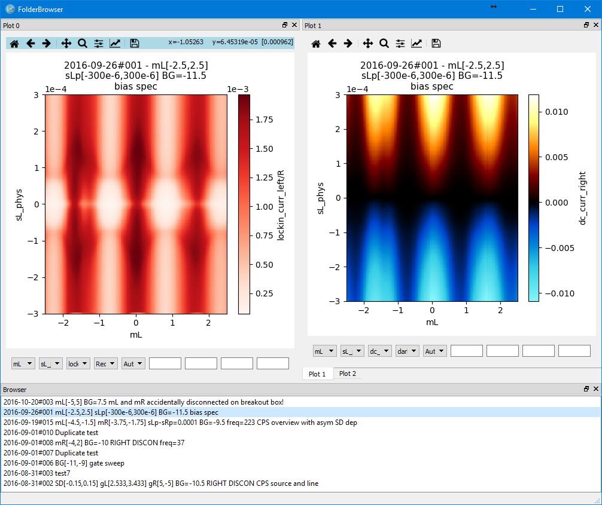
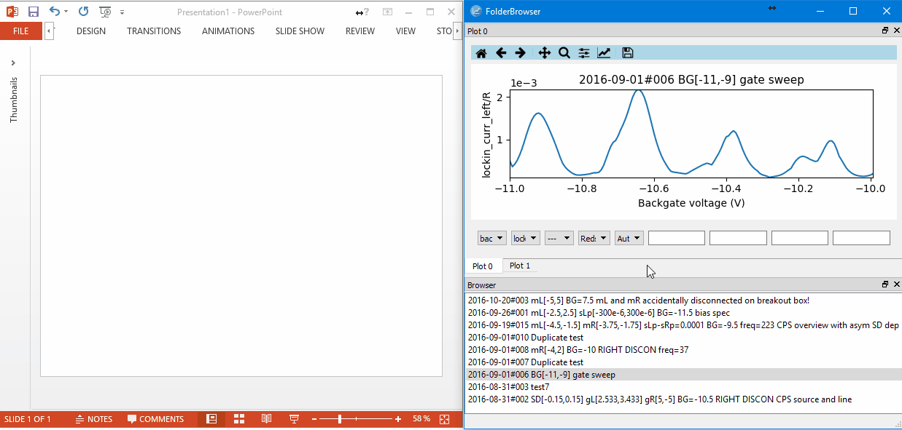
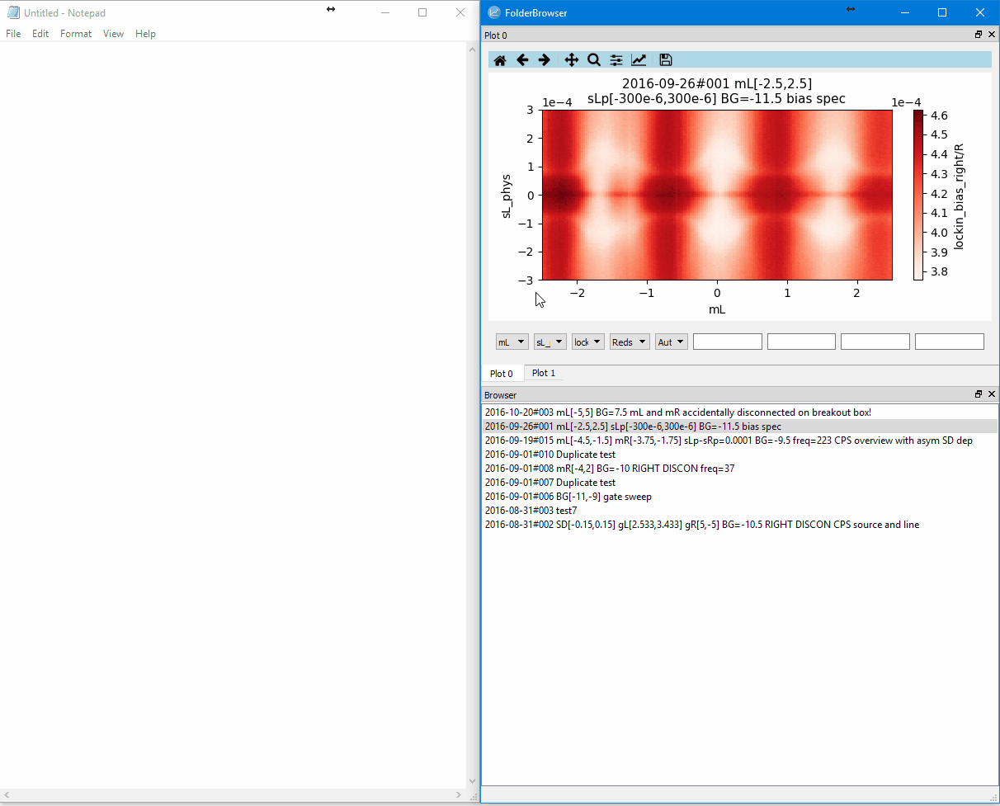
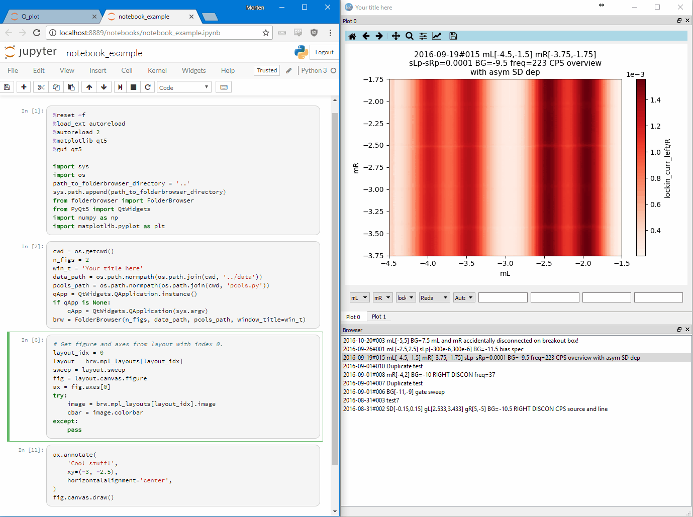
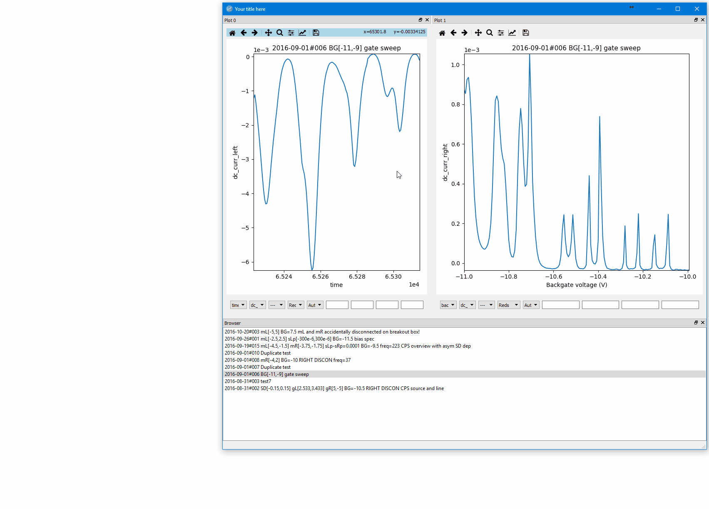

FolderBrowser
=============



Description
-----------
This project provides a GUI for visualizing data acquired with the
[matlab-qd](https://github.com/qdev-dk/matlab-qd) framework by Anders
Jellinggaard. The gui itself is a Python implementation and expansion of the
[gui from matlab-qd](https://github.com/qdev-dk/matlab-qd/tree/master/%2Bqd/%2Bgui).


Features
--------
Copy-paste the active figure with `Ctrl-C`:


Generate code for figure with `F2`:


Modify figure with Matplotlib commands (note that these are captured with `Ctrl-C`, but not with `F2`):


Resize and dock to your heart's content:


Installation
------------
All packages used for FolderBrowser are included in the Anaconda distribution.
Get it from
[https://www.continuum.io/downloads](https://www.continuum.io/downloads) with
the newest Python 3 version.

If you already have Anaconda installed (with Python 3.5) but the packages are
not up to date, simply run
````
conda update anaconda
````
from the terminal to update the packages.

When you have all packages installed run `example.py` in the `examples`
directory.


Requirements
------------
* Python 3+ (tested with version 3.5)
* Matplotlib (tested with version 1.5.3, 2.0)
* PyQt 5 (tested with version 5.6)
* Numpy (tested with version 1.11)


Optional packages
-----------------
* Pandas (improves loading times by a factor 2-10x, tested with version 0.18.1)


Documentation
-------------
- **[User guide](doc/user_guide.md)**
- [DataHandler](datahandler.py)
- [FolderBrowser](folderbrowser.py)
- [MplLayout](mpllayout.py)
- [PlotControls](plotcontrols.py)
- [PlotHandler](plothandler.py)
- [Sweep](sweep.py)


Hotkeys
-------
| Key           | Function      |
| ------------- | ------------- |
| F2            | Copy code for figure to clipboard |
| F5            | Reload file list |
| F6            | Reload pseodocolumn file |
| Ctrl-c        | Copy figure as png |
| Ctrl-t        | Show figure properties in dialog as copyable text |
| Ctrl-w        | Close window |
| Ctrl-shift-o  | Open folder containing data |
| Enter         | Select sweep in the FileList |


Known Issues
------------
### Plotting incomplete 2D data
Incomplete 2D data consists of a number of complete data rows and one partially
completed data row. FolderBrowser truncates the data arrays at load-time so that
a partially completed row is removed. This behavior is different from the
[matlab-qd gui](https://github.com/qdev-dk/matlab-qd/tree/master/%2Bqd/%2Bgui)
where data is truncated at plot-time and only when making image plots. Thus, for
image plots there is no observed difference for the user. For 2D data plotted as
1D, however, a partially completed row is *not* plotted in FolderBrowser, but
*is* plotted in the matlab-qd gui. This behavior can be changed by padding the
reshaped data array with NaN, but this may break other things, like checking
whether the data is linearly varying in DataHandler.

### Python 3.6
This issue appears to be fixed with Python 3.6.1 in Anaconda 4.4.0. See
[https://stackoverflow.com/questions/43264773/pil-dll-load-failed-specified-procedure-could-not-be-found](https://stackoverflow.com/questions/43264773/pil-dll-load-failed-specified-procedure-could-not-be-found)
for reference. Original issue text follows below.

2017-03-31: Anaconda's Python 3.6 distribution may give an error when starting
FolderBrowser:
`DLL load failed: The specified module could not be found.`
In this case downgrade the distribution to Python 3.5 using
````
conda install python=3.5
````
from the terminal.

### More
See also the [TODO file](todo.md).


Contact
-------
Morten Canth Hels: <mortenhels@gmail.com>
